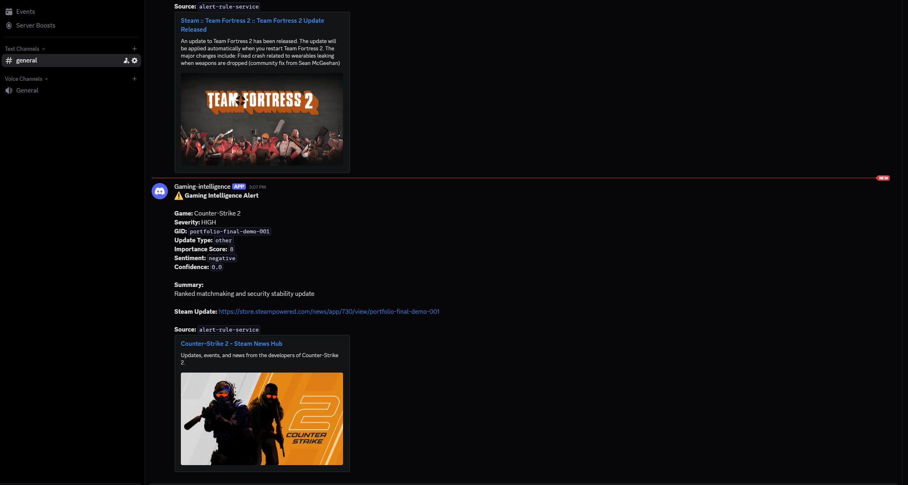
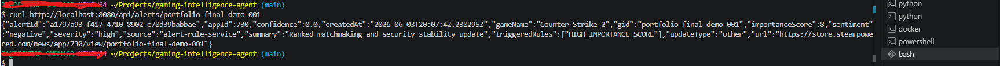
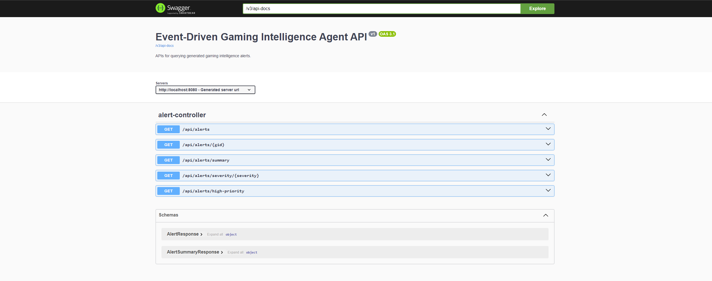
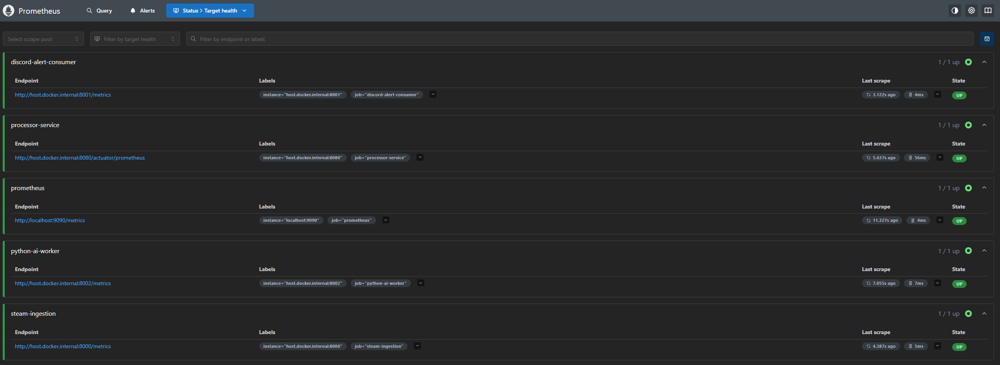
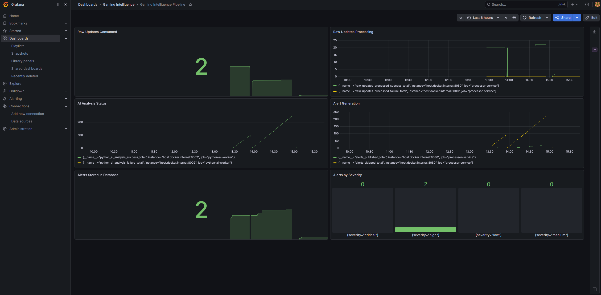
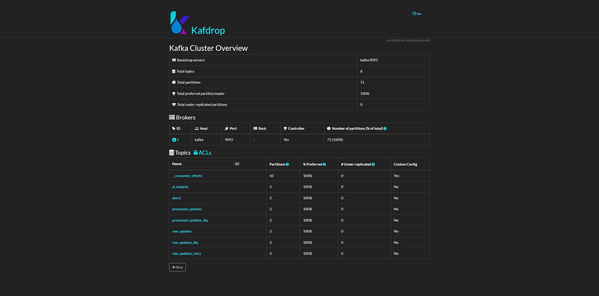
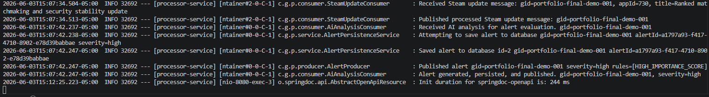
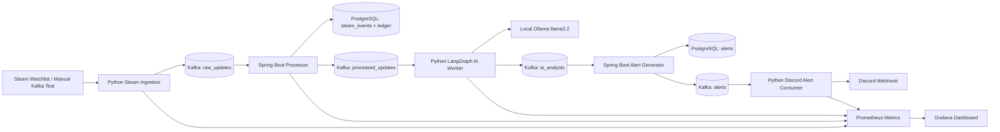

# Event-Driven Gaming Intelligence Agent

A local-first, zero-cost, event-driven gaming intelligence platform that tracks Steam game updates, processes them through Kafka, analyzes update importance with a local LangGraph + Ollama AI worker, persists alerts in PostgreSQL, exposes Spring Boot REST APIs, and sends personalized Discord notifications for high-impact updates.

This project demonstrates backend engineering, distributed systems, event-driven architecture, AI application engineering, observability, idempotent processing, and local infrastructure orchestration showcasing:

- Event-driven architecture
- Apache Kafka message pipelines
- Java 21 / Spring Boot microservice development
- Python service workers
- Local Ollama AI inference
- LangGraph orchestration
- Pydantic validation
- PostgreSQL persistence
- pgvector-ready database architecture
- Idempotent processing
- Retry/DLQ resiliency
- Prometheus metrics
- Grafana dashboards
- Swagger/OpenAPI documentation
- Discord live alert delivery

---

## Demo

### End-to-End Discord Alert



### Alert API Response



### Swagger API Documentation



### Prometheus Targets



### Grafana Metrics Dashboard



### Kafka Topics in Kafdrop



### Local Pipeline Logs



## Architecture Overview



## Tech Stack

- **Backend:** Java 21, Spring Boot 3.3, Spring Kafka, Spring Data JPA
- **Streaming:** Apache Kafka in KRaft mode
- **AI:** Python, LangGraph, Pydantic, local Ollama `llama3.2:latest`
- **Ingestion:** Python Steam Web API ingestion service
- **Database:** PostgreSQL, pgvector, JSONB
- **Notifications:** Discord webhook consumer with duplicate suppression and personalized filtering
- **Observability:** Prometheus, Grafana, Spring Actuator metrics
- **Infrastructure:** Docker Compose, local-first services

## Key Features

- Multi-game Steam watchlist ingestion
- Kafka-based event pipeline with retry/DLQ topics
- Idempotent raw update processing
- Local AI analysis with LangGraph and Ollama
- Structured AI output validation with Pydantic
- Alert generation based on severity, sentiment, update type, and importance score
- PostgreSQL persistence for raw events, AI analysis, and alerts
- REST APIs for alert lookup, severity filtering, summaries, and high-priority alerts
- Swagger/OpenAPI documentation
- Discord alert delivery with duplicate suppression
- Personalized Discord filtering based on watched game keywords
- Prometheus metrics across Java and Python services
- Grafana-ready monitoring

## Run Locally

Start infrastructure:

```powershell
.\scripts\start-infra.ps1

Start the Spring Boot processor:

.\scripts\run-processor-service.ps1

Start the Python AI worker:

.\scripts\run-ai-worker.ps1

Start the Discord alert consumer:

.\scripts\run-discord-alert-consumer.ps1

Optionally start Steam ingestion:

.\scripts\run-steam-ingestion.ps1
```

## Manual End-to-End Demo Test

Send a raw Steam update into Kafka:

Command:

```powershell
docker exec -it kafka /opt/kafka/bin/kafka-console-producer.sh `
  --bootstrap-server kafka:9092 `
  --topic raw_updates
```

Paste this one-line JSON:

{"gid":"portfolio-final-demo-001","app_id":730,"game_name":"Counter-Strike 2","alert_keywords":["security","exploit","matchmaking","ranked","weapon","recoil","balance"],"title":"Ranked matchmaking and security stability update","url":"https://store.steampowered.com/news/app/730/view/portfolio-final-demo-001","author":"Valve","contents":"This update fixes a critical exploit affecting player safety, improves ranked matchmaking stability, and adjusts weapon recoil balance.","date":1717178400,"published_at":"2026-05-31T18:00:00Z"}

Verify the alert API:

curl http://localhost:8080/api/alerts/portfolio-final-demo-001

## Alert APIs

- `GET /api/alerts`
- `GET /api/alerts?severity=medium&limit=10`
- `GET /api/alerts/{gid}`
- `GET /api/alerts/severity/{severity}`
- `GET /api/alerts/summary`
- `GET /api/alerts/high-priority`

Swagger UI:

```text
http://localhost:8080/swagger-ui/index.html
```

---

## Observability

Prometheus:

```text
http://localhost:9090
```

Grafana:

```text
http://localhost:3000
```

Service metrics:

```text
Spring Boot processor: http://localhost:8080/actuator/prometheus
Steam ingestion: http://localhost:8000
Discord alert consumer: http://localhost:8001
Python AI worker: http://localhost:8002
```

## Verification

Run:

```powershell
curl http://localhost:8080/api/alerts/portfolio-final-demo-001
curl http://localhost:8080/api/alerts/summary
curl http://localhost:8080/api/alerts/high-priority
```

Check DB:

```powershell
docker exec -it postgres psql -U gaming -d gaming_ai -c "SELECT gid, game_name, severity, update_type, importance_score, created_at FROM alerts ORDER BY created_at DESC;"
```

Check metrics:

```powershell
curl http://localhost:8001
curl http://localhost:8002
curl http://localhost:8080/actuator/prometheus
```

## Project Status

Implemented:

- Docker Kafka infrastructure
- PostgreSQL + pgvector
- Spring Boot processor service
- Kafka topic initialization
- Kafka retry/DLQ configuration
- Raw update ingestion pipeline
- Idempotent processing ledger
- AI analysis persistence
- Alert generation
- Alert persistence
- Alert APIs
- Swagger/OpenAPI
- Prometheus metrics
- Grafana dashboard support
- Python Steam ingestion service
- Python Discord alert consumer
- Python LangGraph AI worker
- Pydantic AI output validation
- Local Ollama inference
- PowerShell run scripts

Future improvements:

- Add automated integration tests
- Add CI workflow
- Add Dockerfiles for Python services
- Add docker-compose profiles for local demo modes
- Add semantic search APIs using embeddings and pgvector
- Add richer Grafana dashboards
- Add alert severity trend panels
- Add DLQ replay tooling
- Add architecture diagram image 

```

```
